# Settings

After a successful login, you will see Aggies's front end interface as below.  

## Fetching

Fetching allows Aggie to receive feeds from all sources at a global level.

### Toggling ON/OFF Fetching

Fetching can be enabled or disabled by toggling ON/OFF the fetching toggle. To toggle ON/OFF fetching, please follow the steps below.
1. From the menu bar, click **Settings** and select **Settings**.

    

2. Click **ON/OFF** on the fetching toggle to switch fetching ON/OFF.

    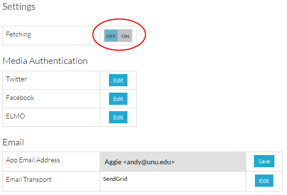

##  Social Media Feed Authentication

### Adding Media Feeds to Aggie

1.  From the header menu, click on **Settings**.

       

2.  From the dropdown list, click on **Settings**.

    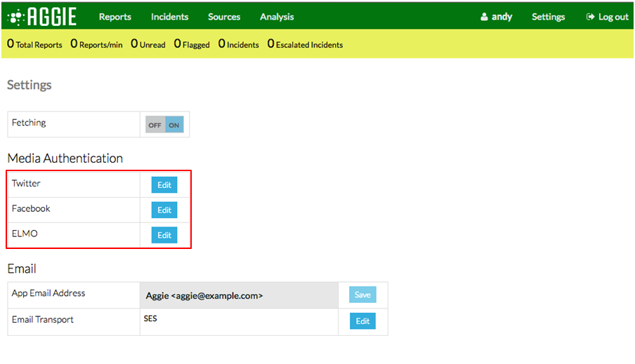

3. Click on **Edit** to authenticate the Twitter, Facebook or Elmo feed settings.  

    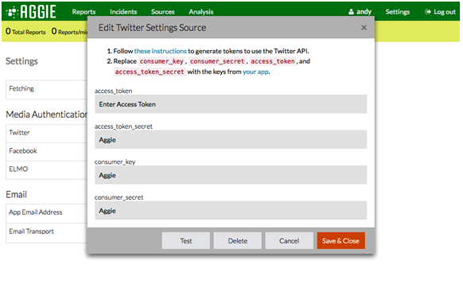

**Note**: *Now we need to generate the access tokens for all social media sources. After that, we would copy and paste respective authentication tokens generated for each of the social media feeds, save the settings and toggle the Fetching switch ON.*

##  Generating Source Tokens

### Twitter API Access Token

1.  Visit [Twitter's Apps Page](https://apps.twitter.com/) and login with your Twitter Credentials.
2.  Click on the **Create New App** Tab.

    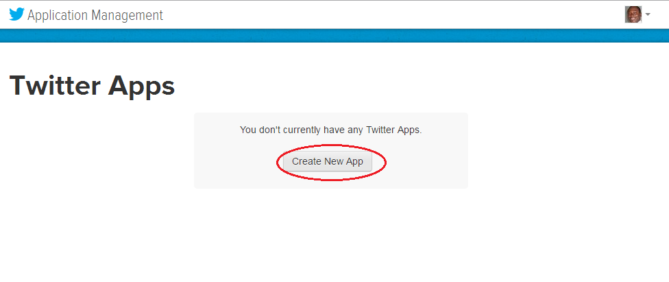

3. Fill in the *Application Details* and agree to the developer agreement at the bottom to create the app.

    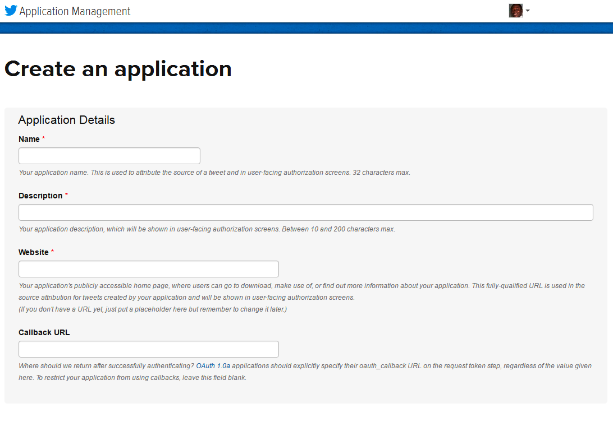

4. This will create access tokens as indicated below.

    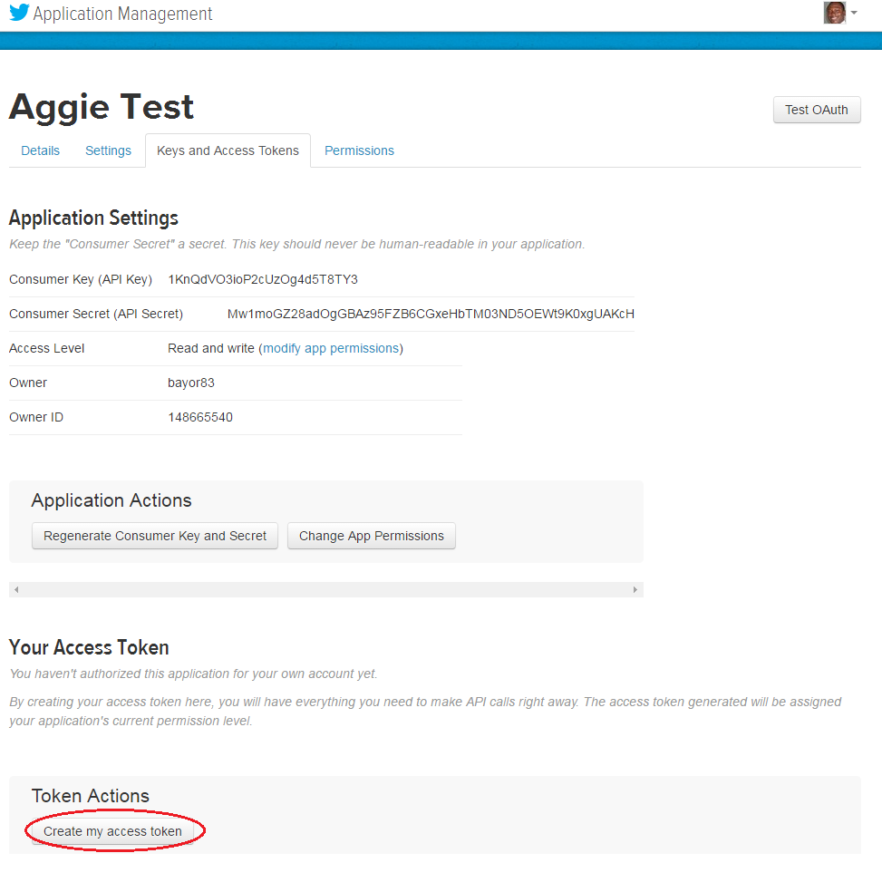

5. Click on **Create My Access Token**  to create *Access Token* and *Access Token Secret*.

    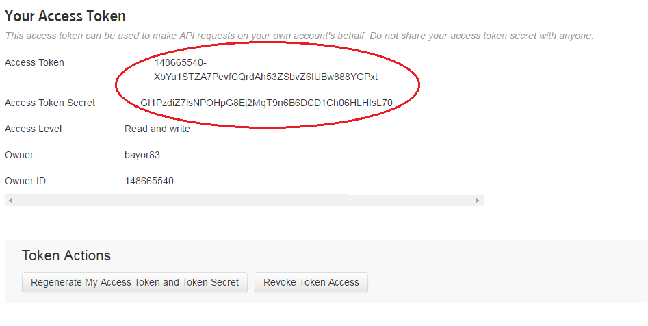

6. With these access tokens, fellow the instructions from [Adding Media Feeds to Aggie](#adding-media-feeds-to-aggie) section and edit the Twitter settings in Aggie.

### Facebook API Access Tokens

1.  Visit [Facebook's Apps page](https://developers.facebook.com/apps/) and login with your credentials.
2.  Click on **Create a new app** at the top right corner.

    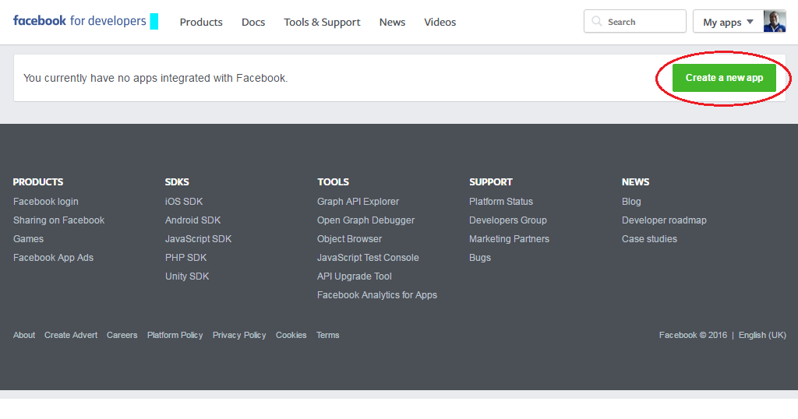

3.  Type in the *name* of your app and click on **Create New Facebook App ID**.

    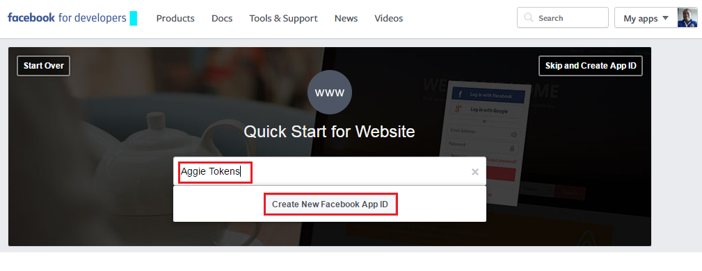

4.  Type in your *email address* and choose the *app category*, eg. *Apps for Pages* and click on **Create App ID**.

    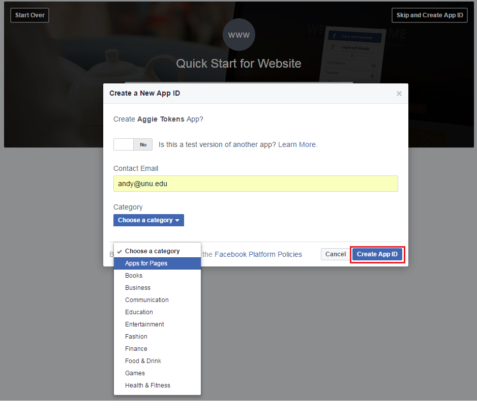

5.  Select the pictures that apply and click **Submit**.
6.  Enter a *site URL* and click on **next**.
7.  Click **Skip to Developer Dashboard** to retrieve your *App ID* and *App Secret*.

    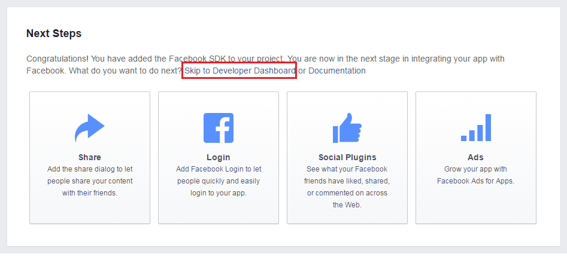

8.  Click on the **Show button** and enter your password to show your *App Secret*.

    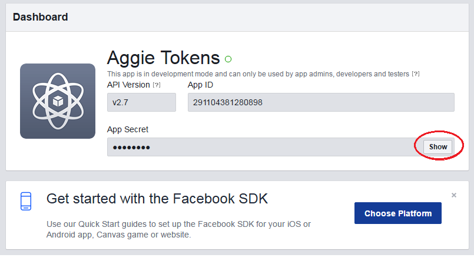

9.  Now with your Facebook *App ID* and *App Secret*, copy **https://graph.facebook.com/oauth/access_token?client_secret=xxx&client_id=xxx&grant_type=client_credentials** into your web browser, replacing the (**xxx**) in **secret = xxx** and **id=xxx** with your *App Secret* and *App ID* respectively.
10.  Hit the return key to show your access token.  
11.  With this access token,fellow the instructions from [Adding Media Feeds to Aggie](#adding-media-feeds-to-aggie) section and edit the Facebook settings on Aggie.

### ELMO Tokens

1.  Log into your *ELMO* instance with an account having *coordinator* or higher privileges on the mission you want to track.
2.  In your ELMO instance, mark one or more forms as *public* (via the Edit Form page). *Note the Form ID in the URL bar (e.g. if URL ends in /m/mymission/forms/123, the ID is 123)*.
3.  Visit your profile page (click the **icon bearing your username** in the top-right corner) and copy your *API key* (click **'Regenerate'** if necessary).
4.  From Aggie, click **Settings -> Settings** and edit the ELMO settings. Remember to toggle the switch on, once you have saved the settings

## Email Settings

This must be set up to allow newly created users to receive emails from Aggie with their login credentials. Three transport options have been implemented using nodemailer.js:
1.  SMTP, which requires having access to a working SMTP server.
2.  Amazon Simple Email Service (SES).
3.  Sendgrid, an online mail service accessible through a simple API.

*In this example we are going to set up the email with Sendgrid’s service.*

1.  Click the **Settings** tab and select the **Settings** option in the dropdown list.

    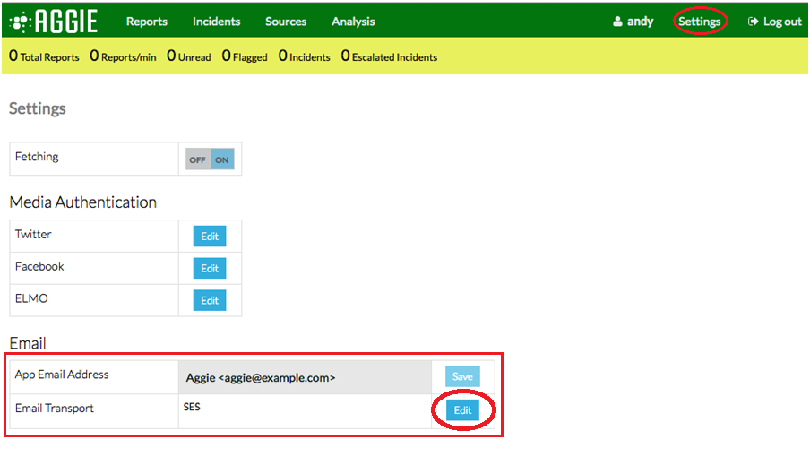

2.  Click **Edit** on the Email transport row of the email section (the last Edit).

    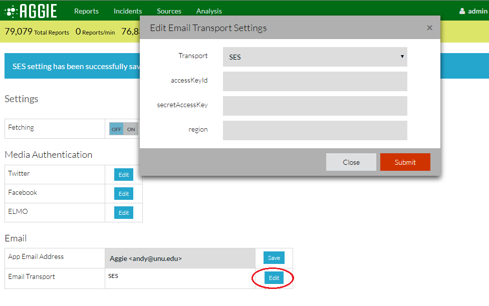

3.  Choose the *Transport method* as *SendGrid*.

    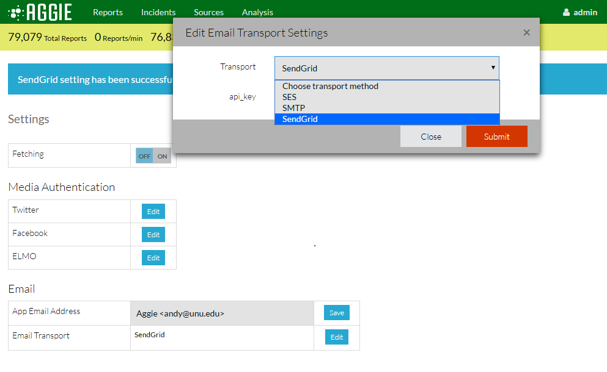

4. Aggie then requests an *API key* for use with SendGrid as in the screenshot below.

    

### Generating SendGrid API Key

1.   Visit [SentGrid's Page](https://sendgrid.com/) and set up an account. Sendgrid will take one or two days to verify your account before activating it.
2.  From your account click the **Settings Menu** and select *API keys*
3.  Click the blue **Create API Key** on the top right.

    

4.  Select *General API key*.

    

5.  Type a name for the API e.g. *Aggie API key* and set the appropriate *permissions*. The only permission needed for this key is the ‘*Mail Send* ’ one.

    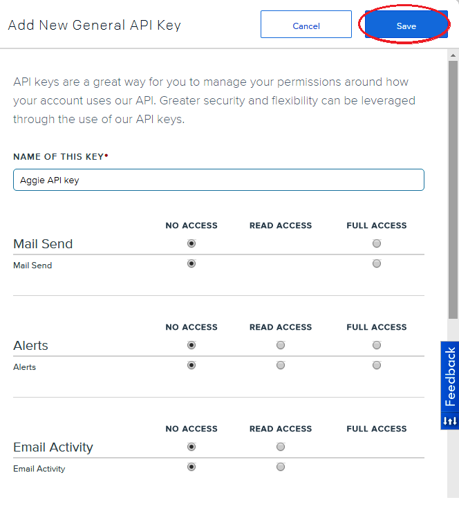

6.  Click **Save** to *generate an API key* for use with Aggie.
7.  Copy the API key and paste it into the *api_key* field referred to in [Transport Email](#transport-email) section and click on Submit.

    

8.  Set the *App Email Address* as the email address you used for your SendGrid application.

    
